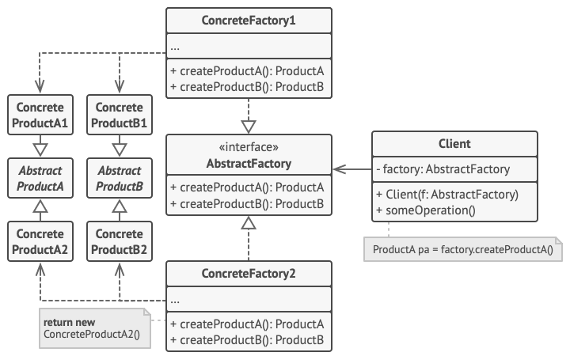
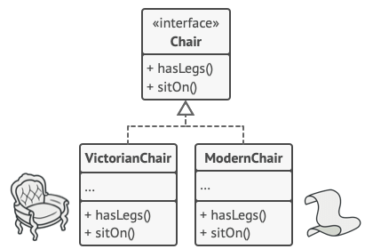
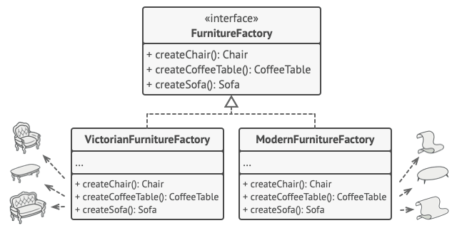
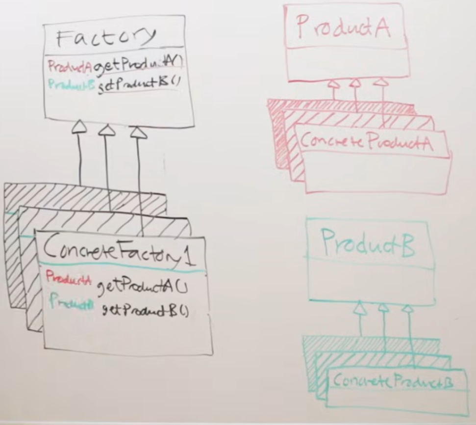

# Abstract Factory

***The “abstract factory” pattern provides an interface for creating families of related or dependent objects w/o specifying their concrete classes.***

The only difference b/w this and FactoryMethod pattern is that this one creates multiple objects of related types.  Whereas, FactoryMethod creates a single object.

The essence is that now a factory (any concretion of a factory) is able to create and return multiple products which are either of the same abstract type OR just related somehow - maybe even just semantically related.

The example I have used in code is of an *Armory* abstract factory - which returns two abstract product types: *weapons* and *armor*. Now, I made three concretions of that abstract *Armory* factory: *stone age*, *medieval age* and, *modern age*. Again, each factory returns those two types of products: *weapon* and *armor*. But, exactly what **product** is created and returned is not really the point here… the concretions of the two abstract **product** types can vary greatly.

This reminds me that probably re-arranging the code (semantically) would make a bit more sense to a first time reader…
