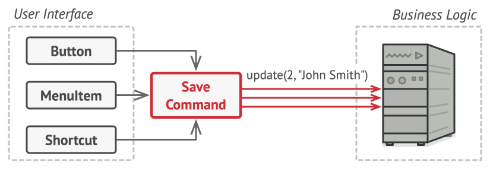
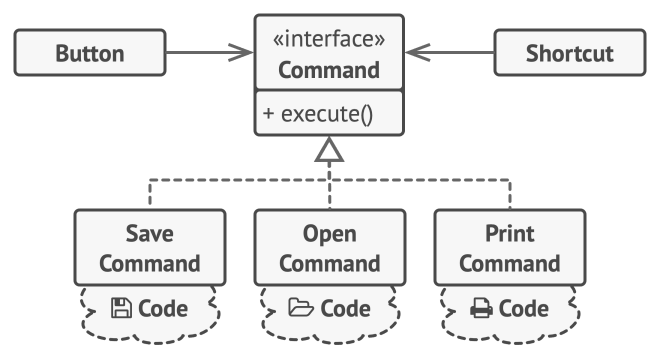

# Command Pattern

**Command** is a behavioral design pattern that turns a request into a stand-alone object that contains all information about the request. This transformation lets you pass requests as a method arguments, delay or queue a request’s execution, and support undo-able operations.

1. The **Sender** class (aka *invoker*) is responsible for initiating requests. This class must have a field for storing a reference to a command object. The sender triggers that command instead of sending the request directly to the receiver. Note that the sender isn’t responsible for creating the command object. Usually, it gets a pre-created command from the client via the constructor.
2. The **Command** interface usually declares just a single method for executing the command.
3. **Concrete Commands** implement various kinds of requests. A concrete command isn’t supposed to perform the work on its own, but rather to pass the call to one of the business logic objects. However, for the sake of simplifying the code, these classes can be merged.
    
    Parameters required to execute a method on a receiving object can be declared as fields in the concrete command. You can make command objects immutable by only allowing the initialization of these fields via the constructor.
    
4. The **Receiver** class contains some business logic. Almost any object may act as a receiver. Most commands only handle the details of how a request is passed to the receiver, while the receiver itself does the actual work.
5. The **Client** creates and configures concrete command objects. The client must pass all of the request parameters, including a receiver instance, into the command’s constructor. After that, the resulting command may be associated with one or multiple senders.

## How to Implement?

1. Declare the command interface with a single execution method.
2. Start extracting requests into concrete command classes that implement the command interface. Each class must have a set of fields for storing the request arguments along with a reference to the actual receiver object. All these values must be initialized via the command’s constructor.
3. Identify classes that will act as *senders*. Add the fields for storing commands into these classes. Senders should communicate with their commands only via the command interface. Senders usually don’t create command objects on their own, but rather get them from the client code.
4. Change the senders so they execute the command instead of sending a request to the receiver directly.
5. The client should initialize objects in the following order:
    - Create receivers.
    - Create commands, and associate them with receivers if needed.
    - Create senders, and associate them with specific commands.

### Example

While this is not the best example out there and still needs a wee bit refactoring to be able to disguise as “Command Pattern” code…

[notastrocat/pokedex](https://github.com/notastrocat/pokedex)
