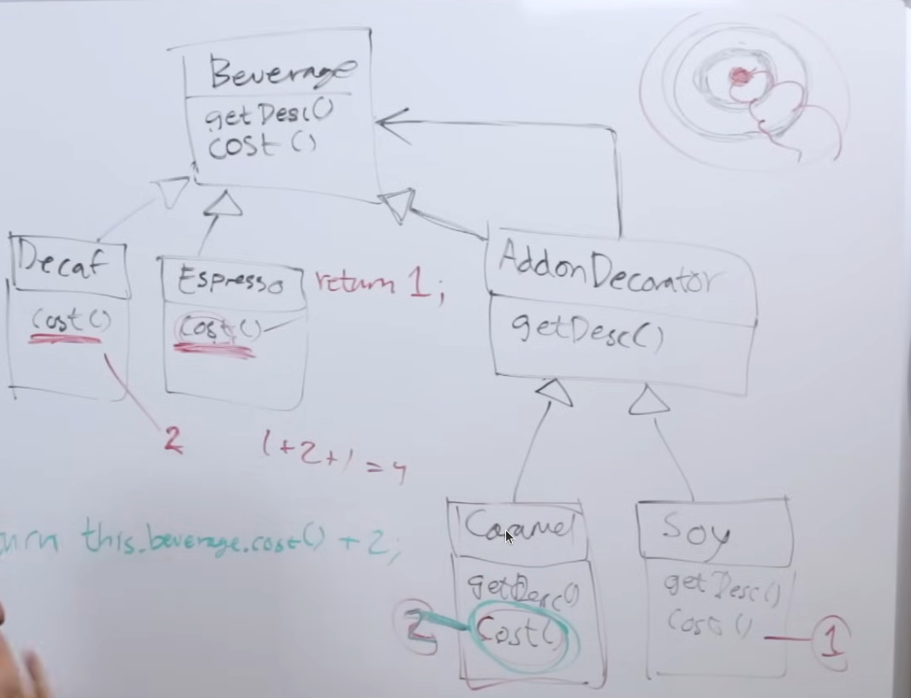

# Decorator Pattern

> ***The decorator pattern attaches additional responsibility to an object, dynamically.  Decorators provide a flexible alternative to sub-classing for extending functionality.***
> 

<aside>
💡

Inheritance is not for code re-use.  It’s not for sharing behavior.

</aside>

This pattern uses *Composition* (we’ll dive into this later) rather than *Inheritance* in order to share behavior.

To give an idea about what the above line means: -
Consider you have subclass A, subclass B and, subclass C… you can now only use these at runtime, you cannot possibly create a new class/configuration derived out of these, at runtime.
However, if you have decorator A, decorator ****B and, decorator C… you can *compose* a new class/decorator out of these, at runtime.

---

### Example

Let’s hop right into an example: -

Walk into a coffee shop, beautiful soft jazz or lo-fi hip-hop playing in the background.

Now, generally speaking a lot of coffee shops also have teas. So let’s assume this one has it too.  We now end up with a **beverage** class.  And three classes which *derive from* this **beverage** class: espresso, decaf and, tea.

Then, since this is a fancy shop - it allows you to fully customize your **beverage**.  Which essentially means that you end up having a bunch of different combinations possible.

---

### Problem

So now if we try to imagine all the possible scenarios and create classes for it - classes which are very thin and do very specific and small jobs - it would be nice.  But, this leads to something called “class explosion”.  Very, very bad for maintainability.

Instead, we could chose to go with “interface segregation”.  However, that too is kind of difficult to maintain in this scenario since at some point we could have a class with absurd combinations like “herbal tea with extra chocolate chips and whipped cream”.  Nightmare.  Note that while the above combination isn’t the end of the world here but we could just as easily run into scenarios like this in some safety-critical application or security violation because of this.

---

### Solution

This is essentially the problem we try to solve using the *Decorator Pattern*.  We still stick to interfaces but we also create an interface in between which wraps the underlying object type.  This pattern is basically my nemesis?  It definitely can lead to wrappers on top of wrappers and we can do nothing about it.

We start off with one **beverage** class.  Three derived classes: **decaf**, **espresso** and, **tea**.  And finally we create an interface: `IAddOnDecorator`.  The derived classes *are-a* **beverage**.  While the interface *is-a* as well as *has-a* **beverage** (of course, because it’s a “wrapper” after all).

Then, it’s just a bunch of concrete implementations of the wrapper interface we created earlier.

<aside>
💡

If a person who chooses a lot of add-ons will end up making the order look like a bunch of concentric circles each pointing to the same inner circle/dot which is the actual beverage.  Each decorator thinks that it’s only wrapping one item.

</aside>

Calling any method of the decorators (and I’m not a 100% sure but you can only do it for the outermost decorator) is just a chain of calls to the innermost function.  If you wish to, you can think of it as recursion where the base case would be hitting the real function call for the actual implementation from one of the derived classes.
Which makes me think - is this a bad pattern because it cause *stack overflow*???



### Code

```cpp
// Base class
Beverage {
	getDescription();
	getCost();
};

// ---

// Derived classes
Tea : Beverage {
	getDescription() {
		return "tea";
	}
	
	getCost() {
		return 2
	}
};

DeCaf : Beverage {
	getDescription() {
		return "decaf";
	}
	
	getCost() {
		return 1.5
	}
};

Espresso : Beverage {
	getDescription() {
		return "espresso";
	}
	
	getCost() {
		return 1
	}
};

// ---

// Wrapper Interface - *Decorator*
IAddOnDecorator : Beverage {
	Beverage bev;
	
	getDescription();
	getCost();
};

// Concrete Implementations of the Wrapper Interface - *AddOn Decorators*
WhippedCream : IAddOnDecorator {
	getDescription() {
		// some impl
	}
	
	getCost() {
		return this.beverage.getCost();
	}
};
```
