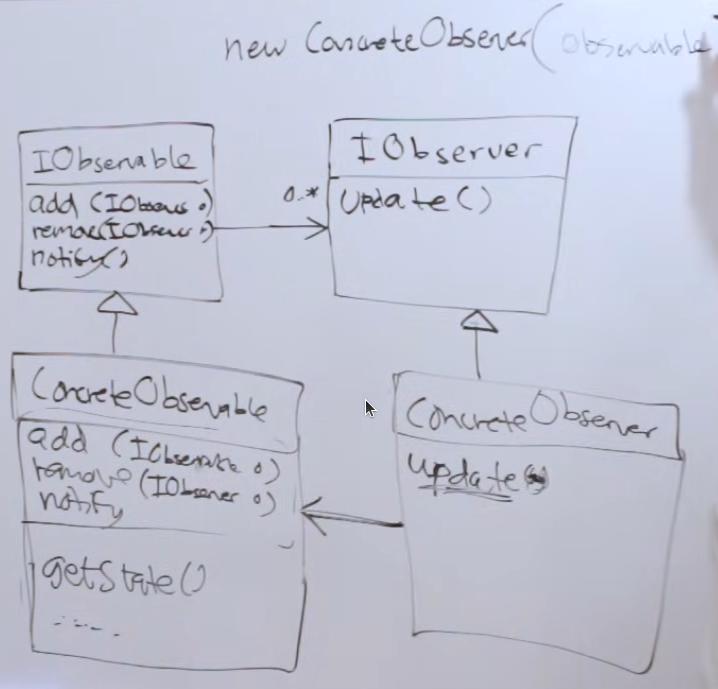

# Observer Pattern

Imagine two things, and one of them changes its state quite often - maybe even at regular intervals of time - but that’s not important right now.  And, the other thing just wants to know the state of the first one, again, *when* it wants to know about the first one’s state is not super important right now.

So, to bring things in perspective, consider that *one* of the **two** things talked about in the above paragraph, is a weather station. And, the other thing is just a display of weather information.
Now, it definitely makes sense why the first one wants to keep changing its state and also why the other one wants to know about the first one’s states.  In other words, one might even say that the *second* thing is a **subscriber** of [certain] information (from the *first* one).

Of course, this is just one example.  Other example could be that the *second* thing is an RSS client which wants to know about the updates to the subscribed RSS feeds (the *first* one).

---

### Push vs Poll

A *poll* architecture would mean that the *second* thing would regularly **ask** the first one if they’ve changed their state.  And, it would need to do it forever, the only question which remains is *at what interval?*
As one could imagine… scaling up is a nightmare in this architecture.  Especially, if the update frequency is quite small.  The responsibility of knowing *whether* the update has happened, or not, falls on the second thing.

A *push* architecture on the other hand, makes this responsibility of knowing *whether* the update has happened, or not, on the first thing.  Duh!  It will always know when the update has happened.
But, now the interesting thing is that the first one should also know about its subscribers - the second thing(s).  And, it has to notify all of them whenever this update happens.

The *first* guy is called an “observable”… and the *second* guy (or set of guys) are called “observers” - because they are usually more than one.

---

> ***An observer pattern defines a one to many dependency b/w objects so that when one object changes its state, all of its dependencies are notified about it and updated automatically.***
> 



I’ll just try to explain the UML a little bit: -

- `IObservable` and `IObserver` are the two interfaces for the “observable” and the “observer” respectively.  As discussed before, the “observable” has [0, *] “observers”.
- `ConcreteObservable` and `ConcreteObserver` are the concrete implementations of the aforementioned interfaces.
- The `add` method for the observable would be used to *register* the subscribers for its notifications.  The `remove` is consequently, the *de-registration* for the observers/subscribers.  And, the `notify` is the notification sent to all the current subscribers.
- Now the weird thing at first glance is the *has-a* relationship b/w the observer and the observable.  But, it’s essential for the observer to know what it is trying to observe.  And, if you think about it now… it’s not at all weird. Look at the top left corner: this is how we create an observer.  So, now when you call its `update` method - which takes no argument, btw - it will know what has been updated.
Don’t get confused because of this.  This doesn’t mean that the observer is *polling* the observable for the required data.  Nuh uh!  In fact, once it gets notified about the state changes - it has a way to access the data that it needs.  So, the `update` method from the observer will eventually trigger the `getSomeData` fn on the observable object.

---

### Example

An example will make it more clear.  Consider a weather station.  It collects weather data using sensors, duh!

```cpp
ConcreteObservable : IObservable {
	vector<ConcreteObserver> subcribers;
	Notify();
	GetSomeData();
};

ConcreteObservable::Notify() {
	for (auto &subsriber : subscribers) {
		subscriber.Update()
	}
}

// ---

ConcreteObserver : IObserver {
	ConcreteObservable observable;
	Update();
};

ConcreteObserver::Update() {
	this.observable.GetSomeDate();
	
	// of course the observable needs to have some meaningful data stored
	// so that it returns that in the above call.
	// and then the observer/subscriber can decide upon what to do w/ that
	// returned/updated data.
}
```

---

Of course, this is just one way of doing this.  This is sort of a push/push ideology where the observable *pushes* the notification about updates and also *pushes* the update to the observer’s instance.
Another way would be have the push/pull ideology where the observable only pushes the notification about the update and the responsibility of pulling these said updates lies with the observer instances.  This is of course still better than polling strategy we discussed earlier.
