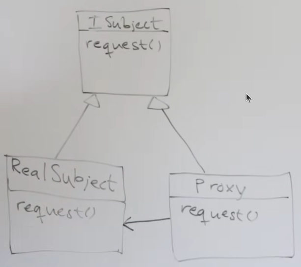
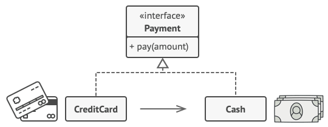
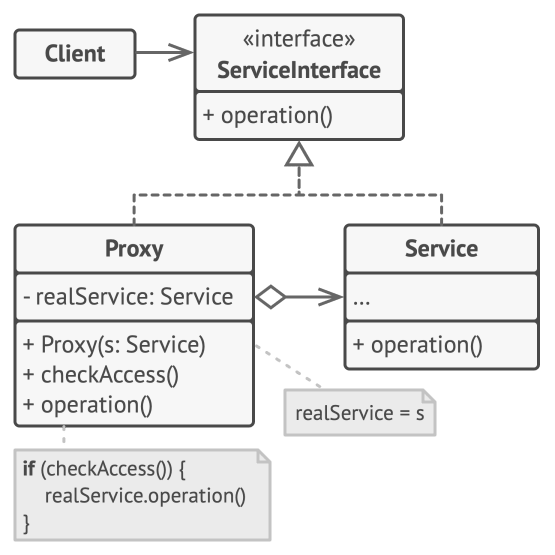
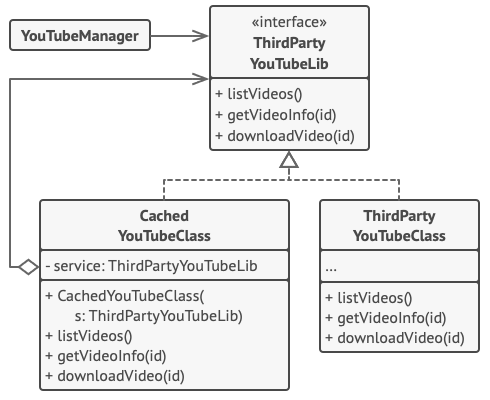

# Proxy Pattern

> ***Provides a surrogate or, a placeholder for another object to control access to it.***
> 

There are 3 types of this pattern: -

- Remote Proxy: suggested for remote stuff - a different server, a different namespace.
- Virtual Proxy: to avoid interacting directly w/ an expensive resource.
- Protection Proxy: control based on access rights/permissions.

We basically control *access* to something(s) by using this pattern.

## UMLs

So, this means that `RealSubject` and `Proxy` *are-a* (or implements) the `ISubject` interface.

And, the `Proxy` also *has-a* (reference to) the `RealSubject`.

1. The **Service Interface** declares the interface of the Service. The proxy must follow this interface to be able to disguise itself as a service object.
2. The **Service** is a class that provides some useful business logic.
3. The **Proxy** class has a reference field that points to a service object. After the proxy finishes its processing (e.g., lazy initialization, logging, access control, caching, etc.), it passes the request to the service object.
    
    Usually, proxies manage the full life-cycle of their service objects.
    
4. The **Client** should work with both services and proxies via the same interface. This way you can pass a proxy into any code that expects a service object.

### Example

This example illustrates how the **Proxy** pattern can help to introduce lazy initialization and caching to a 3rd-party YouTube integration library.

