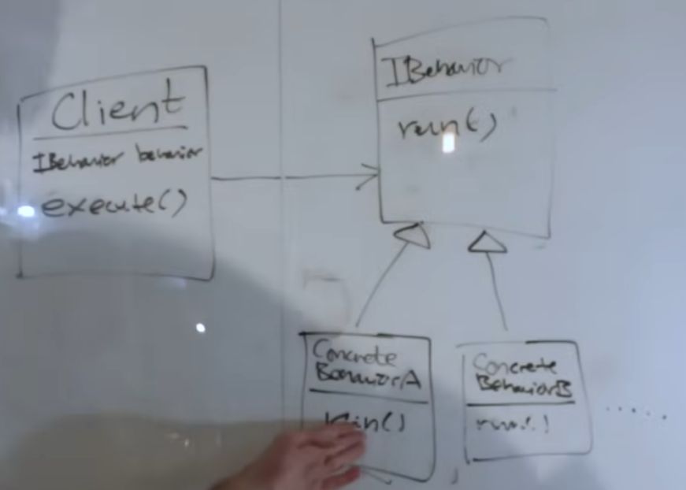

# Strategy Pattern

It’s about using *composition* rather than *inheritance*, because *inheritance* is not really intended for code reuse.

> ***Defines a family of algorithms, encapsulates each one, and makes them inter-changeable. It lets the algorithm vary independently from the clients that use it.***
> 

It makes the algorithm being used by the client, sort of, plug-and-play… it de-couples them totally.

So now when you think about it: this is the easiest point to start learning design patterns. Design patterns talk a lot about how to make code re-usable and inter-changeable, increase the maintainability of code. And then later, more advanced ones tend to focus more on performance optimizations, but we’ll get there.

—|> this is: *is-a* relationship

→ this is: *has-a* relationship

### The Problem we’re tryna solve here

We’ll go a bit in over our head…

Consider a parser class (it parses some proprietary encoding/protocol).

Now, let’s have `parserA` and `parserB` which are children of the aforementioned parent parser class. The parent class has some generic behavior and the children are of course meant to have some custom logic - private to them. Think of it as maybe like a network stream… the `parserA` does something based on the 8th byte of the network stream. And, the `parserB` class does something based on the same 8th byte. So, it does make sense to have two separate classes - rather *thin* classes since there’s only one overridden function from the base class at this point. But hey, this is just a simple example. Real scenarios can have much more complicated use-cases just like this one.

Anyway, moving on, if we now have another `parserC` but get this, in addition to having the custom logic to parse the network stream at 8th byte. This one also needs to have an override for some other function - maybe there’s a “data validity mechanism” that this one needs to have.

Now, add another `parserD` into the picture - this one has similar logic for validity check for the network data stream. Exactly same, just *copy-pasta’d* here. And, of course the custom logic for 8th byte of the network stream.

**Conundrum:** above scenario clearly creates logic and hence code duplication. Does it makes sense to create another class `ValidityCheck()` and have the `parserC` & `parserD` inherit from it (while other classes can choose to skip it since they don’t have any use for it)?

---

One of the solution which *Strategy Pattern* proposes, is to have *interfaces* which will be: *has-a* relationship with the base class.

<aside>
💡

*Note:* the child classes we discussed above so far will be having: *is-a* relationship with the base class.

</aside>

So now we can have interfaces for custom logic: `IParseEighthByte` and even for the extra validity mechanism: `IValidityCheck` .

Now, the derived classes will need to have an implementation of these interfaces when instantiated. Or, rather there should be more *thin* classes for these behaviors: a `SimpleParsingEighthByte` and `SimpleValidityCheckStrategy` (notice the second name is a much more common in real life scenarios because of its clear and semantically meaningful nature). These two classes will be: *is-a* relationship to the real interfaces.

This is a seemingly simple example so having separate interfaces and then some default simple implementations for these classes feels okay. But, keep in mind that in real life scenarios this can easily cause something called a “class explosion”.

One way to avoid that, would to have a single interface for parsing the network data stream and validity check, called `IParserBehavior`. However, it doesn’t make much sense in this example since `ValidityCheck()` is a very specific thing to only a particular set of parser and not all would benefit from having a default validity check method.

This provides quite an interesting opportunity to demonstrate another cool thing with *Strategy Pattern*, which is that we can multiple implementations of the interface classes we have defined. You see, the `ValidityCheck()` method has really no use for the rest off the classes (except `parserC` and `parserD`). But, what we can do is that still push it inside one common interface: `IParserBehavior` and then have the *simple* implementation do nothing, or log something - really doesn’t matter. Then, have another implementation: `RealValidityCheck` and have the actual logic that the two parser classes need here.

So now if you notice carefully, we can inject a lot of algorithms/logic into specific classes. Right? In fact, if you think about it… we don’t even need those highly specific classes anymore.

We can just follow *dependency injection* to now create highly specific instances of the same base class - which would have specific implementations of those algorithms.

<aside>
💡

So, by doing this we’ve also solved the problem of “class explosion”.

</aside>



```jsx
// execute is just a way to run the real implementation of
// the *strategy* or the *behavior*.
execute() {
	this.behavior.run()
}
```

## Read More at:  https://refactoring.guru/design-patterns/strategy
